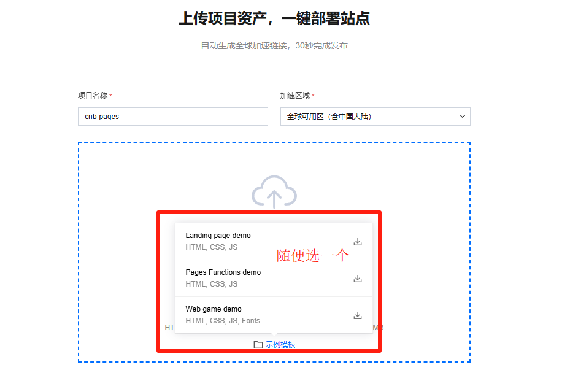
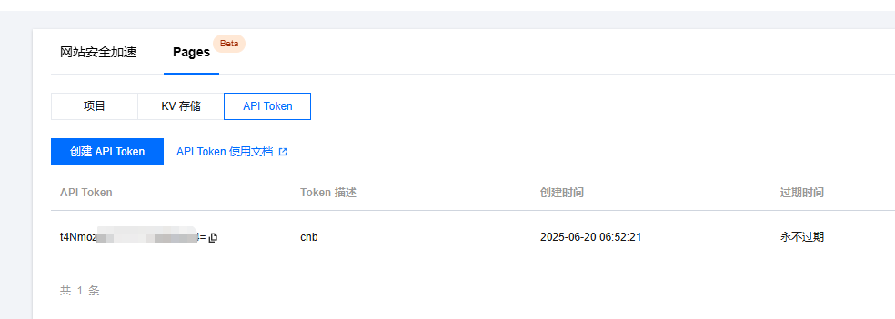
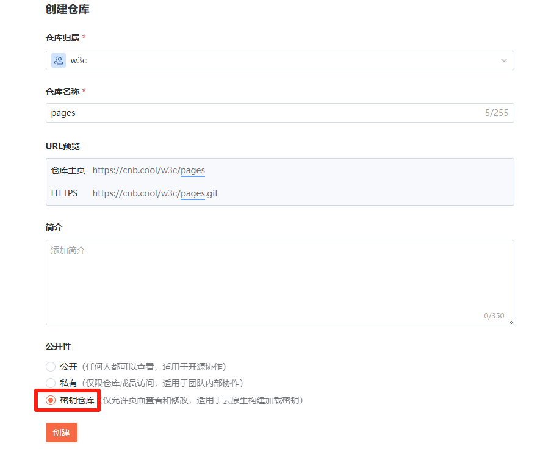
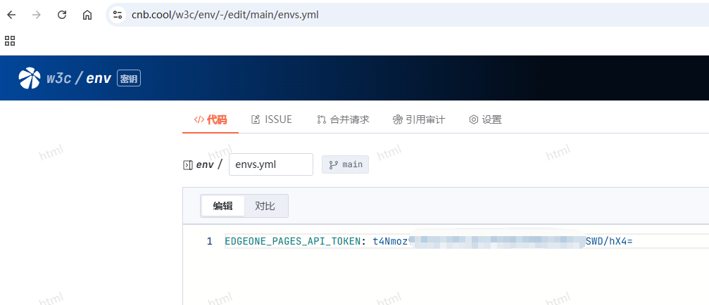
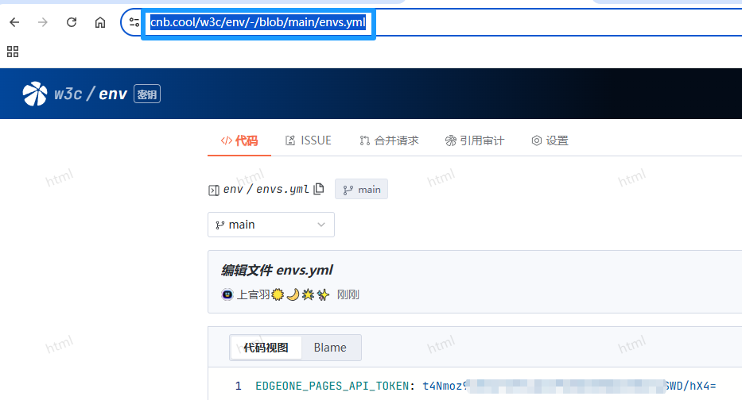

# CNB 1秒上手,2秒上头,启动只需要3秒
# 用vitepress的新手小伙伴想用cnb部署到EdgeOne Pages
# 直接看步骤
# 1,第一步Fork我这个仓库直接就能用，根据以下的步骤来操作，非常简单只需几秒。


## 第二步,创建一个page项目:
点这里新建 https://console.tencentcloud.com/edgeone/pages

创建的时候选择直接上传的方式
随便选一个示例把项目创建了就行如图



## 第三步,获取API token
在pages里面创建API Token
创建后复制即可。



## 之后在cnb中新建一个密码仓库




在密码仓库里增加一个文件，此文件用来存poages里面创建的API Token
文件后缀是.yml名字随意,比如是：'envs.yml'

envs.yml文件内容为：

```
EDGEONE_PAGES_API_TOKEN: 这里冒号后面全部替换成API token,一件复制粘贴到此处
```


保存完之后复制这个文件envs.yml的地址


在回到你fork的这个仓库，点击 .cnb.yml文件，粘贴刚才复制的网址。


之后保存提交即可。